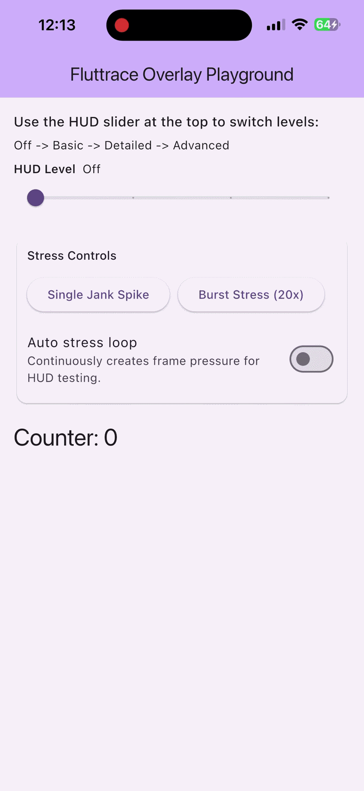

# fluttrace

A lightweight, production-safe Flutter package for real-time frame timing analytics. `fluttrace` provides a modular architecture to collect, aggregate, and visualize performance metrics directly in your app without relying on external dependencies.



## Features

- **Real-time Performance HUD**: A customizable, clickable-through overlay widget to display frame statistics live.
- **Detailed Metrics**: Automatic aggregation of p50, p95, and p99 frame times.
- **Jank Detection**: Alerts you when frame times exceed customizable thresholds.
- **Pluggable Transports**: Easily export performance reports to console, analytics, or custom endpoints.
- **Zero External Dependencies**: Built entirely with standard Flutter APIs.

## Installation

Add `fluttrace` to your `pubspec.yaml`:

```yaml
dependencies:
  fluttrace: ^1.1.3
```

Then run `flutter pub get`.

## Getting Started

### 1. Initialize Fluttrace

Before running your app, initialize the performance monitor and attach any desired transports (e.g., `ConsolePerfTransport`):

```dart
import 'package:flutter/material.dart';
import 'package:fluttrace/fluttrace.dart';

void main() async {
  WidgetsFlutterBinding.ensureInitialized();
  
  // Add a transport to log performance metrics
  Fluttrace.instance.addTransport(ConsolePerfTransport());
  
  // Start the engine
  await Fluttrace.instance.start();
  
  runApp(const MyApp());
}
```

### 2. Add the Performance Overlay

Wrap your app's root widget (or the `builder` of your `MaterialApp`) with `FluttraceOverlay` to see real-time metrics on screen:

```dart
class MyApp extends StatelessWidget {
  const MyApp({super.key});

  @override
  Widget build(BuildContext context) {
    return MaterialApp(
      title: 'Fluttrace Example',
      builder: (context, child) => FluttraceOverlay(child: child!),
      home: const MyHomePage(),
    );
  }
}
```

## Metrics Glossary

Fluttrace collects the following metrics:

### Frame Phase Timings
Raw timings for an individual frame:
- **UI (`uiMs`)**: Time spent executing Dart code on the main UI thread (building widgets, layout, paint).
- **RASTER (`rasterMs`)**: Time spent by the Flutter engine (GPU) to draw the frame to the screen.
- **TOTAL (`totalMs`)**: The total wall-clock duration of a single frame (UI + Raster).

### Aggregated Metrics
Statistics calculated over a recent batch of frames (sliding window):
- **FPS**: Frames Per Second, calculated as `(Number of Frames * 1000) / Active Time`, capped at the target framerate (e.g., 60).
- **p50 (Median)**: The 50th percentile of total frame times. 50% of frames rendered faster than this value.
- **p95 / p99**: The 95th and 99th percentiles of frame times. High values here indicate stuttering and outlier jank spikes.

### Jank & Dropped Frames
- **Jank**: A frame is considered "janky" if its total time exceeds the budget (e.g., > 16.6ms on a 60Hz display).
- **Jank Rate**: The percentage of frames in the current window that were janky (e.g., 0.05 = 5%).
- **Dropped Frames**: An estimate of completely missed screen refreshes due to janky frames.

## Custom Transports

You can easily build custom transports to send metrics to your analytics backend (e.g., Firebase, Datadog) by implementing the `PerfTransport` interface:

```dart
import 'package:fluttrace/fluttrace.dart';

class MyAnalyticsTransport implements PerfTransport {
  @override
  Future<void> send(FrameReport report) async {
    // Send p50, p95, p99 to your analytics service
  }

  @override
  Future<void> onAlert(FrameAlert alert) async {
    // Report jank spikes to your analytics service
  }
  
  @override
  Future<void> dispose() async {
    // Clean up resources if necessary
  }
}
```

## HUD Controller

You can programmatically adjust the level of detail displayed in the overlay using the `FluttraceHudController`:

```dart
// Levels: 0 = Off, 1 = Basic, 2 = Detailed, 3 = Advanced
FluttraceHudController.instance.setLevel(2);
```

Or you can use the built-in slider widget in your UI:

```dart
const FluttraceHudLevelSlider()
```

## License

This project is licensed under the MIT License.
